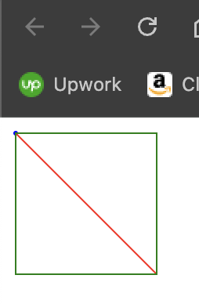
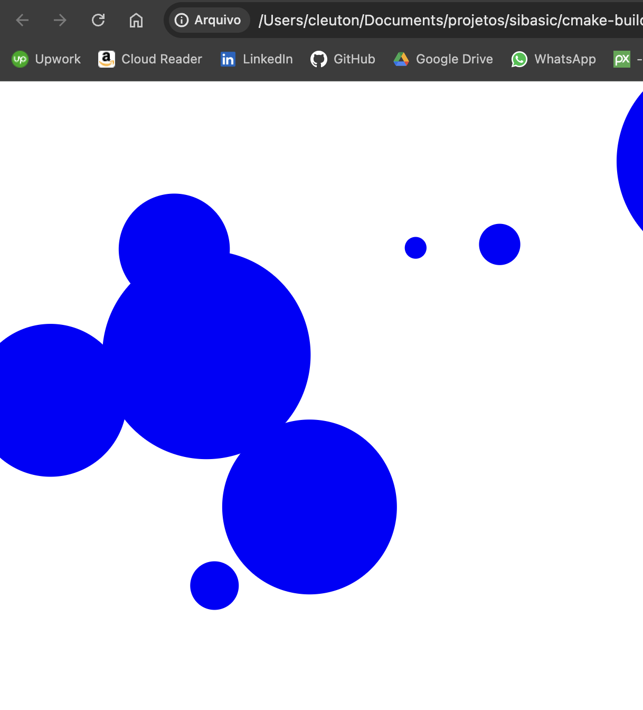

# sibasic - Simple Basic Interpreter


[**Cleuton Sampaio**](https://linkedin.com/in/cleutonsampaio)

# VERSÃO 0.0.4

SiBasic é um interpretador muito simples da linguagem **BASIC**. Na verdade, ele implementa um *subset* da linguagem, 
para fins de estudo de algoritmos, estruturas de dados e compiladores. 

Ele é um projeto totalmente funcional, separado em: 

- **Executor**: Arquivo main.cpp, lê o código BASIC, interpreta e executa.
- **Lexer**: Arquivo lexer.cpp. Um lexer (analisador léxico) é a primeira etapa de um interpretador. 
Ele recebe o código fonte como entrada e o converte em uma sequência de tokens, que são unidades léxicas 
significativas, como palavras-chave, identificadores, números e símbolos. Esses tokens são então passados para o 
analisador sintático para formar a estrutura gramatical do código. Em resumo, o lexer identifica e classifica os 
- elementos do código fonte em tokens que são mais fáceis de serem processados pelo interpretador.
- **Parser**: Arquivo parser.cpp. O parser (analisador sintático) é a segunda etapa de um interpretador. Ele recebe a sequência de tokens produzida pelo lexer e verifica se ela está de acordo com a gramática da linguagem de programação. O parser constrói uma representação hierárquica da estrutura do código, chamada de árvore de análise sintática (AST), que captura a relação entre os diferentes elementos do código, como expressões, declarações e comandos. Essa árvore é então utilizada pelo interpretador para realizar a execução do programa, interpretando cada nó da árvore e realizando as ações correspondentes de acordo com a semântica da linguagem. Em resumo, o parser traduz a sequência de tokens em uma estrutura de dados que o interpretador pode utilizar para entender e executar o código fonte.
- **Interpreter**: Arquivo interpreter.cpp. Um Interpreter (intérprete) é a terceira e última etapa de um interpretador. Ele recebe a estrutura de dados produzida pelo parser, geralmente uma árvore de análise sintática (AST), e executa as instruções representadas por essa estrutura. O intérprete interpreta cada nó da árvore e executa as ações correspondentes de acordo com a semântica da linguagem de programação. Isso envolve avaliar expressões, executar comandos, controlar o fluxo do programa e interagir com o ambiente de execução. Em resumo, o intérprete é responsável por efetivamente executar o código fonte, transformando-o em resultados observáveis ou efeitos no sistema conforme definido pela linguagem.

## Build do projeto

Se você não quiser ou não souber fazer o build do projeto, eu providenciarei binários para algumas plataformas. No caso 
do MacOS você terá que autorizar a execução no item PRIVACIDADE E SEGURANÇA dos AJUSTES DO SISTEMA.

É só ver na parte de **RELEASES** do **GitHub** e procurar o binário para a sua plataforma.

Nem todas as plataformas estarão lá. 

Ele tem um arquivo **CMakeLists.txt** 

Se não estiver instalado, instale o cmake (versão >= 3.28): 
- sudo apt install cmake
- sudo snap install cmake

1. Clone o projeto.
2. Crie uma pasta **build**.
3. Vá para a pasta **build**.
4. Execute o comando ```cmake ..```.
5. Execute o comando ```make```.

O executável **sibasic** estará na pasta **build**.

Se quiser entender o **CMake** e o **CMakeLists.txt** vá para o título final deste arquivo.

## Execução do SiBasic
```shell
sibasic <path do código basic>
```

Se quiser ver os tokens, que são a saída do **Lexer** e a **AST - Abstract Syntax Three**, que é a saída do **Parser**, 
basta informar o flag **-v** (modo verboso).

Exemplo: 
```shell
./sibasic ../basic_programs/trigonometricos.bas

Fonte: 10 LET ANGULO = 0
Linha 10 tokens:
NUMERO_LINHA: 10
COMANDO: LET
IDENTIFICADOR: ANGULO
OPERADOR: =
NUMERO: 0
FIM_DE_LINHA: 
AST para a linha line 10:
NoDePrograma
  NoDoComandoLET: 10 >> ANGULO
    NoDeNumero: 0

Fonte: 20 PRINT "ANGULO:"
Linha 20 tokens:
NUMERO_LINHA: 20
COMANDO: PRINT
DESCONHECIDO: ANGULO:
FIM_DE_LINHA: 
AST para a linha line 20:
NoDePrograma
  NoDoComandoPrint: 20 >>  literal: 1

Fonte: 30 PRINT ANGULO
Linha 30 tokens:
NUMERO_LINHA: 30
COMANDO: PRINT
IDENTIFICADOR: ANGULO
FIM_DE_LINHA: 
AST para a linha line 30:
NoDePrograma
  NoDoComandoPrint: 30 >>  literal: 0
    NoDeIdentificador: ANGULO
...

ANGULO:
0
SENO:
0
COSSENO:
1
TANGENTE:
0
ANGULO:
15
SENO:
0.258819
COSSENO:
0.965926
TANGENTE:
0.267949
ANGULO:
30
SENO:
...
Comando END

```

## Roadmap

Pretendo acrescentar alguns comandos e caso alguém queira participar, é só fazer um **pull request** que eu avalio. 

Eis a funcionalidade que pretendo acrescentar: 

- **Subrotinas** - Comando **GOSUB / RETURN**: ```GOSUB 100 ... RETURN```;
- **Leitura e gravação de arquivos** - Comandos: 
  - **OPEN** - ```LET ARQ = OPEN(<arquivo>)```;
  - **WRITE** - ```WRITE ARQ <expressão>```;
  - **READ** - ```LET A = READ(ARQ)```;
  - **CLOSE** - ```CLOSE ARQ```;
- **Loop com FOR** - Comando **FOR / NEXT**: ```FOR X=1 TO N... NEXT X```;
- **Matrizes** - Variáveis bidimensionais: ```DIM M 10 7```;
- **Dimensionar vetores e matrizes com variáveis***: ```DIM V X```

E também pretendo gravar o programa em formato **AST - Abstract Syntax Three** binário, evitando nova interpretação. 
Como um **bytecode**.

## Linhas válidas

Toda linha de comando deve começar com um número de linha que não deve se repetir. Preferencialmente, devem vir em sequência, 
mas o interpretador não reforça isso. 

Uma linha começando pelo caractere "*" (no lugar do número de linha) é considerada comentário e descartada. Em **BASIC** 
existe o comando **REM** para isso, porém ele exige número de linha e é tratado pelo LEXER e PARSER. Eu acho melhor simplesmente
ignorar a linha. 

## Variáveis e vetores

Todas as variáveis são numéricas reais de precisão dupla. Elas podem ser vetores (não matrizes), se as declararmos com o comando **DIM**.

## Comandos BASIC

Cada linha deve conter um e somente um comando BASIC. Todas as linhas devem ser numeradas. 
O **Executor** transforma todos os caracteres em maiúsculas antes de interpretar.

Os seguintes comandos **BASIC** foram implementados: 

- **DIM**: Declara vetores.
- **LET**: Atribui valores ou expressões às variáveis.
- **GOTO**: Desvio incondicional para uma linha. 
- **PRINT**: Exibe o resultado de uma expressão na console. Pode imprimir literais.
- **IF**: Desvio condicional para uma linha.
- **END**: Termina o programa.
- **INPUT**: Lê um valor **double** digitado e atribui a uma variável.
- **DRAW**: Inicializa ou termina um arquivo SVG com desenhos;
- **PLOT**: Desenha pontos ou círculos;
- **LINE**: Desenha linhas;
- **RECTANGLE**: Desenha retângulos;

Este é um dos programas de exemplo: 
```basic
10 LET A = 5
20 LET B = 7
30 IF A < B THEN 50
40 END
50 PRINT A
```

### DIM

Este comando declara um **vetor**. No SiBasic os vetores são BASE 1, ou seja, a primeira posição é 1 e não zero. Sua sintaxe é: 
```basic
DIM <nome do vetor> <número de posições>
```

Um vetor só pode ter uma dimensão.

### LET

Este comando atribui valores ou resultado de **expressões** às variáveis. Estas variáveis podem ser simples ou vetores. Vetores sempre devem ser indexados. Exemplos: 
```basic
10 DIM V 10
20 LET X = 1
30 LET V[X] = EXP(X) * 0.34
40 LET X = X + 1
50 IF X > 10 THEN 70
60 GOTO 30
70 LET X = 1
80 PRINT V[X]
90 LET X = X + 1
100 IF X < 11 THEN 80
```

Se a variável for um vetor, deve ser indexada. O indexador pode ser uma variável ou um número inteiro.

### GOTO

Desvio incondicional: 
```basic
GOTO <número da linha>
```

### PRINT

Exibe o resultado de uma **expressão** na console. Pode ser um número, uma variável ou uma expressão contendo ambos e funções.
```basic
PRINT -3
```

Podemos imprimir literais: 
```basic
PRINT "ESTE É UM LITERAL"
```

Não aceita mais de um parâmetro. Só pode fazer PRINT de uma coisa de cada vez.  

### IF

Desvio condicional. Este comando compara dois operandos e desvia para a linha especificada caso a condição seja verdadeira. Sua sintaxe é: 
```basic
IF <variável> <operador lógico> <variável ou expressão> THEN <número da linha>
```

O primeiro operando não pode ser uma expressão, devendo ser uma variável. O segundo pode ser uma expressão unária (um só membro).

### END

Termina a execução do programa. Pode haver mais de um comando **END** no seu programa. Ao encontrar este comando, a execução termina.

### INPUT

Lê um valor **double** digitado e o atribui a uma variável. Sintaxe:
```basic
20 INPUT X
30 PRINT X
```

### DRAW

O comando **DRAW** serve para inicializar ou terminar desenhos (pontos, círculos, linhas e retângulos). 
O **SiBasic** permite desenhar em um arquico **SVG**. Essa solução é melhor para multiplataforma. 

Será criado um arquivo **SVG**, na pasta do executável do SiBasic, com o nome:
```shell
<path>/<nome do script Basic>_DRAW_AAA-MM-DD_HH-MM-SS.svg
````
Há duas formas do comando **DRAW** de uso obrigatório e em sequência em conjunto: 

- **DRAW START** altura, largura: Inicializa o SVG com a altura e largura máximas;
- **DRAW FINISH**: Finaliza e grava o arquivo.

Todos os comandos de desenho emitidos entre o **DRAW BEGIN** e o **DRAW END** serão gravados no arquivo como tags **SVG**. Vários editores abrem arquivos SVG inclusive navegadores web.

## PLOT 

Este comando desenha um ponto ou um círculo dependendo do valor passado no raio: 
```shell
PLOT <x>,<y>,<raio>,<cor>,[FILL]
```

As coordenadas X e Y são o centro do ponto ou círculo.

Para desenhar um ponto, passe raio = 1. O atributo cor pode ser obtido em: https://www.w3.org/TR/SVG11/types.html#ColorKeywords. Exemplos: 
- BLACK
- RED
- YELLOW
- WHITE
- BLUE
- GREEN
- GRAY

O atributo **FILL** se estiver presente preencherá o retângulo com a cor escolhida.

## LINE

O comando **LINE** desenha uma linha, com espessura 1 e uma cor que você pode escolher: 
```shell
LINE <x>,<y>,<x2>,<y2>,<cor>
```

As coordenadas X e Y são o ponto inicial e X2 e Y2 são o ponto final. O atributo **cor** é o mesmo do comando **PLOT**.

## RECTANGLE

Este comando desenha um retângulo vazado ou uma caixa: 
```shell
RECTANGLE <topleft x>, <topleft y>, <bottomright x>, <bottomright y>, <cor>, [FILL]
```

- **topLeft x**: X do canto superior esquerdo.
- **topLeft y**: Y do canto superior esquerdo.
- **bottom right x**: X do canto inferior direito.
- **bottom right y**: Y do canto inferior direito.
- **cor**: Semelhante à do comando **PLOT**.
- **FILL**: Se informado, preenche o retângulo com a cor especificada.


As coordenadas X e Y são o ponto inicial e X2 e Y2 são o ponto final. O atributo **cor** é o mesmo do comando **PLOT**.

## Exemplos dos comandos de desenho

Aqui está um exemplo básico de desenho: 
```basic
10 LET X = 10
20 LET Y = 10
30 DRAW START 500, 500
* PLOT <x>,<y>,<raio>,<cor>,[FILL]
40 PLOT X, Y, 1, BLUE
* LINE <x>,<y>,<x2>,<y2>,<cor>
50 LINE X, Y, 100, 100, RED
* RECTANGLE <topleft x>, <topleft y>, <bottomright x>, <bottomright y>, <cor>,[FILL]
60 RECTANGLE X, Y, 100, 100, GREEN
70 DRAW FINISH
```

Eis o arquivo resultante "desenhos.bas_DRAW_2024-06-16_10-07-21.svg":



E outro exemplo que desenha círculos aleatórios:
```basic
* Desenha bolinhas aleatórias
10 DIM X 20
20 DIM Y 20
30 DIM RAIO 20
40 LET I = 1
50 LET X[I] = RND() * 1000
60 LET Y[I] = RND() * 1000
70 LET RAIO[I] = RND() * 100
80 LET I = I + 1
90 IF I < 20 THEN 50
100 DRAW START 10000, 10000
110 LET I = 1
120 PLOT X[I], Y[I], RAIO[I], BLUE, FILL
130 LET I = I + 1
140 IF I < 20 THEN 120
150 DRAW FINISH
```

Eis o arquivo resultante  "randomplot.bas_DRAW_2024-06-16_10-08-54.svg":



## Expressões

Os comandos **LET** e **PRINT** admitem expressões, que podem conter: **variáveis**, **operadores aritméticos**, **funções** e **negativo unário**.
Eis alguns exemplos de expressões válidas: 
```basic
A = 5
B=(SIN(A) + 3) ^2
V[X] = X + 50
-(SIN(A) + B)
```

Os operadores aritméticos suportados são: 
- **Adição**: +
- **Subtração**: -
- **Multiplicação**: *
- **Divisão**: /
- **Exponenciação**: ^

## Funções

Esta versão não permite utilizar o comando **DEF FN** para definir funções. Estão implementadas as seguintes funções: 

- **Seno**: SIN
- **Cosseno**: COS
- **Tangente**: TAN
- **Logarítmo natural**: LOG
- **Exponenciação natural**: EXP
- **Raíz quadrada**: SQR
- **Valor absoluto**: ABS
- **Número aleatório entre zero e 1**: RND

As funções trigonométricas assumem que os ângulos estão em graus (e não em radianos).

## Exemplos legais

Saber se um número é primo com o **crivo de Eratóstenes**: 
```basic
10 DIM A 100
20 LET I = 2
30 IF I > 100 THEN 60
40 LET A[I] = 1
50 LET I = I + 1
55 GOTO 30
60 LET I = 2
70 IF I > 100 THEN 120
80 IF A[I] = 0 THEN 110
90 LET J = I * 2
100 IF J > 100 THEN 110
105 LET A[J] = 0
107 LET J = J + I
108 GOTO 100
110 LET I = I + 1
115 GOTO 70
* Na próxima linha você digita o número que quer verificar:
120 PRINT "DIGITE UM NÚMERO DE 1 A 100"
121 INPUT N
122 PRINT "VERIFICANDO SE O NUMERO É PRIMO"
123 PRINT N
130 IF A[N] = 0 THEN 160
140 PRINT "PRIMO"
150 GOTO 170
160 PRINT "NÃO É PRIMO"
170 END
```

A linha 120 permite digitar um número para ser avaliado. 

Equação do segundo grau com a **fórmula de Bhaskara**: 
```basic
* Coeficientes
* Exemplos
** Delta > 0: 1, 3, -4
** Delta = 0: 1, -6, 9
** Delta < 0: 1, 5, 7
1 PRINT "COEFICIENTE A:"
10 INPUT A
11 PRINT "COEFICIENTE B:"
20 INPUT B
21 PRINT "COEFICIENTE C:"
30 INPUT C
* Delta
40 LET D = B ^ 2 - 4 * A * C
42 LET E = B ^ 2
50 IF D = 0 THEN 200
60 IF D < 0 THEN 300
70 LET X1 = (-B + SQR(D)) / 2 * A
80 LET X2 = (-B - SQR(D)) / 2 * A
82 PRINT "O DELTA É POSITIVO RAIZES:"
90 PRINT X1
100 PRINT X2
110 END
* Delta zero
200 LET X1 = -B / 2 * A
205 PRINT "O DELTA É ZERO RAIZ:"
210 PRINT X1
220 END
* Delta negativo
300 PRINT "O DELTA É NEGATIVO"
```

Cálculos trigonométricos: 
```basic
* Calcula seno cosseno e tangente para vários ângulos em um circulo de raio 1.
10 LET ANGULO = 0
20 PRINT "ANGULO:"
30 PRINT ANGULO
40 PRINT "SENO:"
50 PRINT SIN(ANGULO)
60 PRINT "COSSENO:"
70 PRINT COS(ANGULO)
80 PRINT "TANGENTE:"
90 PRINT TAN(ANGULO)
100 LET ANGULO = ANGULO + 15
110 IF ANGULO > 90 THEN 130
120 GOTO 20
130 END
```

Estatística descritiva: 
```basic
* Calcula estatística descritiva de uma amostra
10 DIM AMOSTRA 5
12 LET X = 1
13 PRINT "AMOSTRAS:"
14 LET AMOSTRA[X] = 1 + RND() * 10
15 PRINT AMOSTRA[X]
16 LET X = X + 1
18 IF X > 5 THEN 25
20 GOTO 14
* Calcula a média
25 LET MEDIA = 0
30 LET I = 1
35 LET MEDIA = MEDIA + AMOSTRA[I]
40 LET I = I + 1
45 IF I > 5 THEN 52
50 GOTO 35
52 LET MEDIA = MEDIA / 5
55 PRINT "A MÉDIA É:"
60 PRINT MEDIA
* Calcula o desvio padrão
65 LET J = 1
70 LET DESVIO = 0
75 LET DESVIO = DESVIO + (AMOSTRA[J] - MEDIA) ^ 2
80 LET J = J + 1 
85 IF J > 5 THEN 92
90 GOTO 75
* O desvio padrão amostral é dividido por n - 1:
92 LET DESVIO = SQR(DESVIO / 4)
95 PRINT "O DESVIO PADRÃO DA AMOSTRA É:"
100 PRINT DESVIO 
```

## Entendendo o CMake e o CMakeLists.txt

O arquivo `CMakeLists.txt` é um script de configuração usado pelo CMake, uma ferramenta de automação de build. Este arquivo define como o seu projeto deve ser construído, especificando os arquivos de código-fonte, dependências, bibliotecas, e outras opções de compilação. Em essência, `CMakeLists.txt` é uma receita que descreve o que é necessário para compilar e linkar seu projeto.

Aqui está um exemplo detalhado de um `CMakeLists.txt` simples para um projeto C++:

```cmake
### Especifica a versão mínima do CMake necessária
cmake_minimum_required(VERSION 3.10)

### Nome do projeto
project(MyProject)

### Define o padrão de compilação como C++17
set(CMAKE_CXX_STANDARD 17)

### Adiciona o executável (nome do executável e arquivos de código-fonte)
add_executable(MyExecutable main.cpp other_file.cpp)

### Inclui diretórios de cabeçalho
include_directories(include)

### Adiciona bibliotecas necessárias
### target_link_libraries(MyExecutable PRIVATE my_library)

### Define flags de compilação (opcional)
set(CMAKE_CXX_FLAGS "${CMAKE_CXX_FLAGS} -Wall -Wextra -Werror")

### Define variáveis de configuração (opcional)
set(MY_VAR "SomeValue")
```

### Explicação dos comandos:

1. **cmake_minimum_required(VERSION 3.10):** Define a versão mínima do CMake necessária para construir o projeto. Isso garante que o CMake utilizado suporte os comandos e recursos usados no script.

2. **project(MyProject):** Define o nome do projeto. Isso também configura variáveis associadas ao projeto, como `MyProject_BINARY_DIR` e `MyProject_SOURCE_DIR`.

3. **set(CMAKE_CXX_STANDARD 17):** Define o padrão C++ a ser usado (neste caso, C++17). Isso informa ao compilador para compilar o código com suporte para o padrão especificado.

4. **add_executable(MyExecutable main.cpp other_file.cpp):** Adiciona um executável ao projeto. O primeiro argumento é o nome do executável, e os argumentos subsequentes são os arquivos de código-fonte que compõem o executável.

5. **include_directories(include):** Inclui diretórios de cabeçalhos adicionais. Isso permite que você adicione diretórios onde estão localizados arquivos `.h` ou `.hpp` que devem ser incluídos no projeto.

6. **target_link_libraries(MyExecutable PRIVATE my_library):** (Comentado neste exemplo) Linka bibliotecas externas ao executável. Substitua `my_library` pelo nome da biblioteca que deseja linkar.

7. **set(CMAKE_CXX_FLAGS "${CMAKE_CXX_FLAGS} -Wall -Wextra -Werror"):** Define flags de compilação adicionais. Neste exemplo, estamos adicionando flags para mostrar todos os avisos, avisos extras, e tratar avisos como erros.

8. **set(MY_VAR "SomeValue"):** Define uma variável personalizada que pode ser usada em outras partes do `CMakeLists.txt`.

### Exemplo de projeto com bibliotecas:

Se você tem um projeto que depende de bibliotecas externas, o `CMakeLists.txt` pode ser mais complexo. Aqui está um exemplo que adiciona uma biblioteca e a linka ao executável:

```cmake
cmake_minimum_required(VERSION 3.10)
project(MyProject)

set(CMAKE_CXX_STANDARD 17)

# Adiciona uma biblioteca estática
add_library(MyLibrary STATIC src/mylibrary.cpp)

# Inclui diretórios de cabeçalho
include_directories(include)

# Adiciona o executável
add_executable(MyExecutable src/main.cpp src/other_file.cpp)

# Linka a biblioteca ao executável
target_link_libraries(MyExecutable PRIVATE MyLibrary)

# Adiciona flags de compilação (opcional)
set(CMAKE_CXX_FLAGS "${CMAKE_CXX_FLAGS} -Wall -Wextra -Werror")
```

Neste exemplo:

- `add_library(MyLibrary STATIC src/mylibrary.cpp)`: Cria uma biblioteca estática a partir do arquivo `mylibrary.cpp`.
- `target_link_libraries(MyExecutable PRIVATE MyLibrary)`: Linka a biblioteca estática `MyLibrary` ao executável `MyExecutable`.

### Passos para construir o projeto:

Depois de criar seu `CMakeLists.txt`, siga os passos abaixo para construir o projeto:

1. **Navegue até o diretório do projeto:**
   ```sh
   cd /path/to/your/project
   ```

2. **Crie um diretório de build:**
   ```sh
   mkdir build
   cd build
   ```

3. **Execute o CMake para gerar os arquivos de build:**
   ```sh
   cmake ..
   ```

4. **Compile o projeto:**
   ```sh
   make
   ```

Esses passos gerarão e compilarão o projeto de acordo com as especificações no `CMakeLists.txt`.

### Documentação Adicional:

Para mais informações sobre CMake e `CMakeLists.txt`, consulte a [documentação oficial do CMake](https://cmake.org/documentation/).